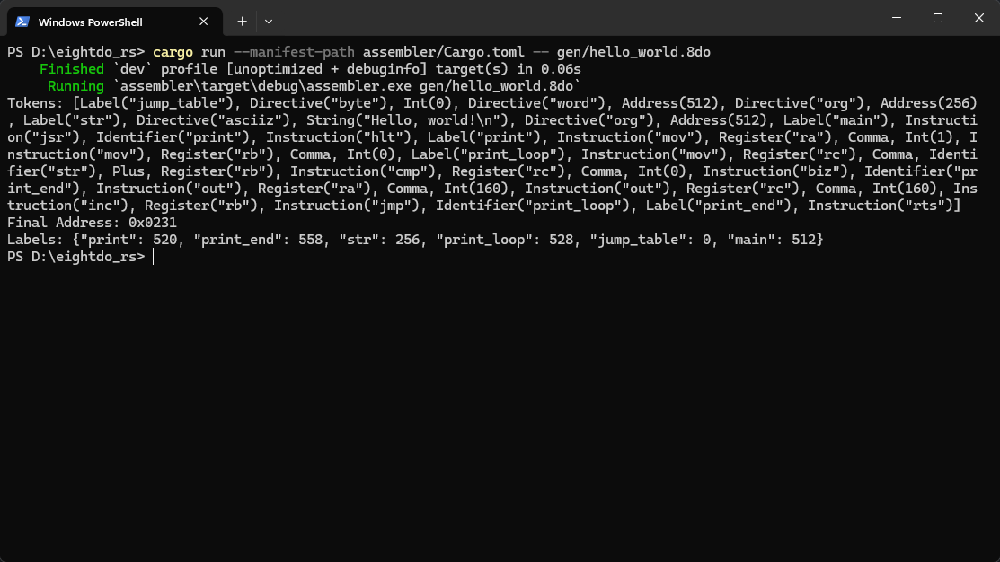
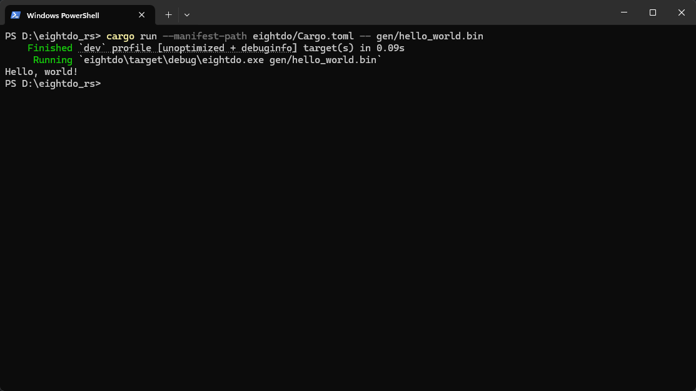

***THIS README WAS FOR THE 8-BIT VERSION. DEVELOPMENT IS NOW SWITCHED TO 16 BITS.***

# 8do

8do in Rust. Idk why but I didn't like my C++ implementation.

Docs are copied over from the C++ project and haven't been updated at all.

## Small specification
- 8-bit
- 4 Registers
	- A: General Purpose
	- B: General Purpose
	- C: General Purpose
	- D: General Purpose
- 18-bit address bus
- 8-bit data bus
- 10-bit Stack Pointer
- 8-bit IO Mapped Hardware (256 Addresses)

## Compiling a Hello world program.


## Running a Hello world program.


## Hello World Program & Explanation

### Program
```
jump_table: .byte 0x00 .word $0200

.org $0100

str: .asciiz "Hello, world!\n"

.org $0200

main:
    jsr print        ; Jump to the print subroutine
    hlt              ; Halt the CPU. This exits the program.

print:
    mov ra, 0x01     ; String Mode
    mov rb, 0x00     ; Index
print_loop:
    mov rc, str + rb ; Get character

    cmp rc, 0x00     ; Have we reached the end of the string?
    BIZ print_end    ; Yes, end the subroutine

    out ra, 0xA0     ; No, write the mode to the out device
    out rc, 0xA0     ; Write the character to the device
    inc rb           ; Increment index
    jmp print_loop   ; Loop back
print_end:
    rts              ; Return out of the subroutine
```

### Explanation

First, we create a jump table at the zero page.

```
jump_table: .byte 0x00 .word $0200
```

We use a byte and a word since 8do addresses are 18 bits. Anything over a 3 (3 bits total) will be ignored and only read bit 0 and 1. (Address directive?)

Next, we put our program somewhere in ROM. Any address in the range 0x0000 - 0x7FFF is ROM. (RAM is 0x8000 - 0x3FFFF)
We define a str label with some string data. `asciiz` puts a 0 at the end of the string. If that behavior is unwanted, use `ascii`.

```
.org $0100

str: .asciiz "Hello, world!\n"
```

Moving a little bit more ahead of ROM, we define our program. We jump to the `print` subroutine, then halt after we return from it.

```
.org $0200

main:
    jsr print        ; Jump to the print subroutine
    hlt              ; Halt the CPU. This exits the program.
```

We load some registers with some values which will be used in the loop.

```
print:
    mov ra, 0x01     ; String Mode
    mov rb, 0x00     ; Index
```

In the loop, we first fetch the character at str plus a offset.

```
print_loop:
    mov rc, str + rb ; Get character
```

A offset can be a value or a register `0x00` - `0xFF`. This is a signed number and follows two's complement. 

If the character is a zero, we go to the label `print_end`. If it isn't zero, we just go ahead as usual.

```
cmp rc, 0x00     ; Have we reached the end of the string?
BIZ print_end    ; Yes, end the subroutine
```

The branch instructions follow a naming format.

`B01`
- B: Branch
- 0: Can be I or N (If or Not)
- 1: A flag's name (Z, N, C, O, L, G, I)

We then write to the Out device, which uses stdout.
The first write tells the device the mode, which can be 0 or 1 (Int or Char).
Finally, the second write actually sends the data.

```
out ra, 0xA0     ; No, write the mode to the out device
out rc, 0xA0     ; Write the character to the device
```

Increment the index and do it all over again.

```
inc rb           ; Increment index
jmp print_loop   ; Loop back
```

At the end of the string, we just call `rts`. This returns the program to the instruction after the `jsr`.

## Additional Information

1. Again, documentation inside `doc/` is out of date. Do not follow it when testing things out for yourself. If you do test things out and have questions, message me on Discord or any other social media [linked here](https://taromaruyuki.cc/socials).

2. This CPU is planned to be used in a custom PC I am building. Any information here about IO Addresses or Mapped Addresses may not apply there. These apply to the code inside `main.rs`, which was made more for testing instead of being its own individual thing.

3. This project does not currently have a license. USA copyright laws apply, which means you cannot: ***"reproduce, distribute, or create derivative works."*** This ***will*** be changed in the future.
